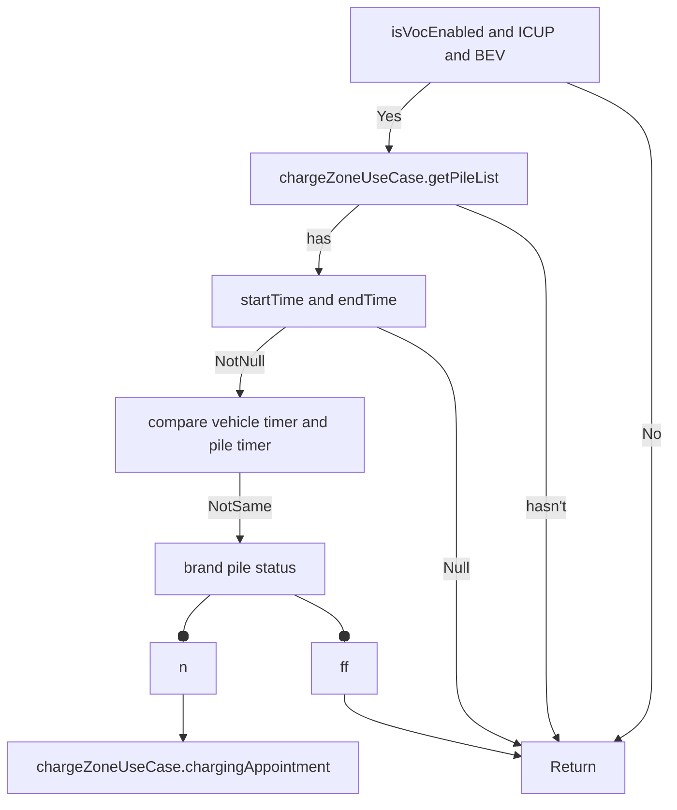

# Charger

```mermaid
graph TD
    A[isVocEnabled and ICUP and BEV]
    B[chargeZoneUseCase.getPileList]
    C[Return]
    D[startTime and endTime]
    E[ compare vehicle timer and pile timer]
    F[chargeZoneUseCase.chargingAppointment]
    G[brand pile status]
    A -- Yes --> B
    A -- No --> C
    B --has -->D
    B --hasn't --> C
    D --NotNull --> E
    D --Null --> C
    E --NotSame --> G
    G --on --> F
    G --off --> C
```

### China
1:提供查询桩列表的usecase  是否支持预约充电
2:提供预约充电的usecase

## APAC
1: APAC提供车机是否支持预约充电
2: 提供充电的开始和结束时间