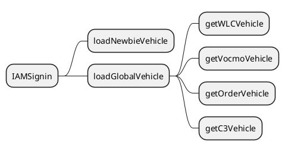

# China-App-Doc

## What we did in the last sprint {id="what-we-done-in-the-last-sprint_1"}
for china app, we obtain both newbie vehicle relationship and global vehicle relationships

- when loadNewbieVehicle is completed, the app will hold an array of VINS, like [vinA,vinB]

- when loadGlobalVehicle is completed, the app will hold an array of VINS, like [vinB,vinD]

- then app will then compare the two arrays,

    - if the user's current preffered vehicle is in the global vehicle list, then the app will consider the user's current preffered vehicle  is already active the remote function.

    - if not , then consider this vehicle as not having actived the remote function.

- to the example i mentioned earlier,

    - the vinA is not actived the remote function, the vinB is actived the remote function.

    - So, if the user's current preffered vehicle is vinA, then the app will consider the user's current preffered vehicle is not actived the remote function.
then app will display a view to start create relationship.

    - For the vinB, user will directly display the vehicle control view

**For the exceptional scenarios, if loadGlobalVehicle is failed, then the app will hold an empty array, 
then the app will consider the user's current preffered vehicle  is not actived the remote function.**

## What we done in the last sprint

-  We observe loadGlobalVehicle function, if this function is failed, we will navigate to a retry view, 
and the user will be dericted to the homepage only when the loadGlobalVehicle is successful

but this is still a feature flag, we only rollout 10% of our users. we will rollout 50% of our users in the week if there is nothing wrong.

