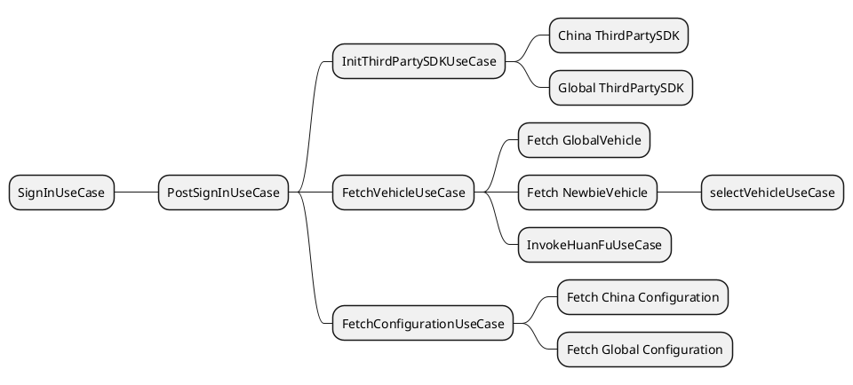

# SignInFlow

> Current
>
{style="note"}

```plantuml
@startmindmap
* SignInUseCase
    * PostSignInUseCase
        * InitThirdPartySDKUseCase
            * China ThirdPartySDK
            * Global ThirdPartySDK
        * FetchVehicleUseCase
            * Fetch GlobalVehicle
            * Fetch NewbieVehicle
                * selectVehicleUseCase
            * InvokeHuanFuUseCase
        * FetchConfigurationUseCase
            * Fetch China Configuration
            * Fetch Global Configuration

@endmindmap

```

Start typing here...